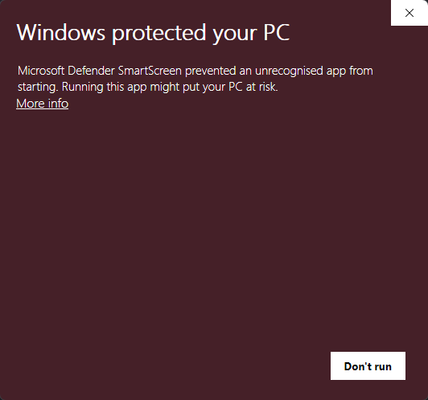
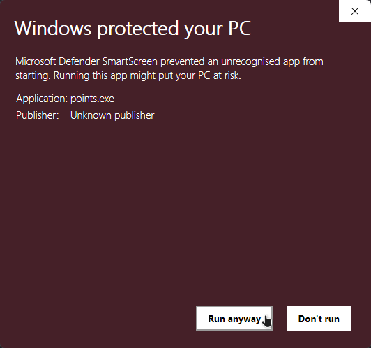

# Challenge List List Points Calculator
**[The website of the Challenge List](https://challengelist.gd) is currently bugged.**
The Stats Viewer is displaying the *wrong* amount of List Points. This is because of an error in the code of the website that is very difficult to resolve. 

**If you want to check how many List Points you really have**
Then go to the [releases](https://github.com/48exa/cl-point-calculator/releases/tag/Release) and download *points.exe* 

---
When you run the file you *might* be shows this screen 

**This is not because the application contains a virus or other malware, it is purely because it isn't licensed**

Just click on *more info* and then click on *run away*
(like so)

---
If you are still afraid of malware you can also clone this repository and build the application yourself, you do need to have [Rust](https://www.rust-lang.org/tools/install) installed and set up.
